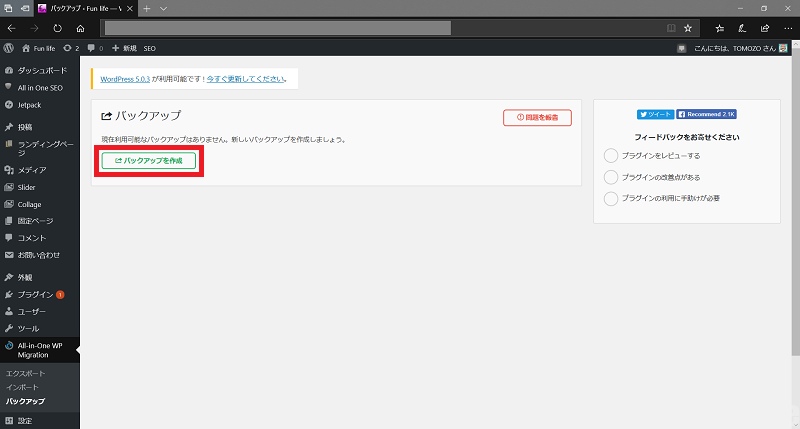
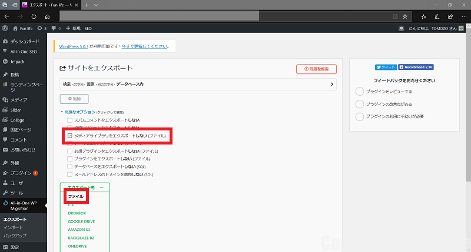
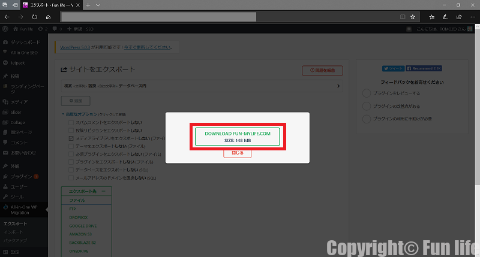
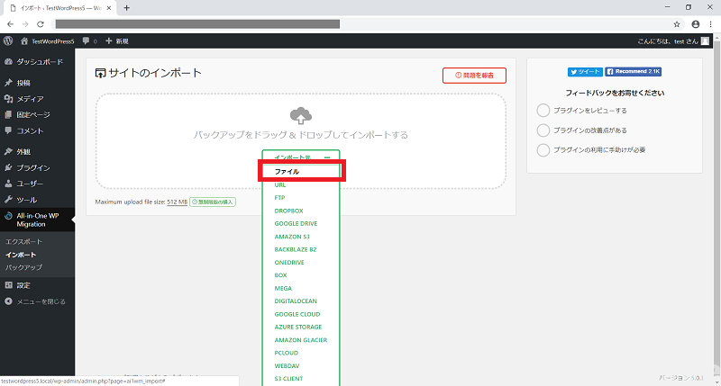
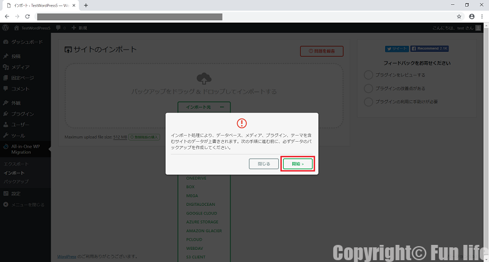
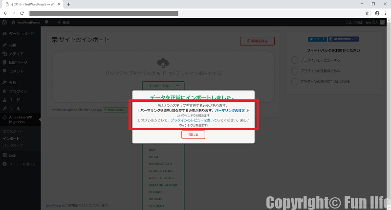
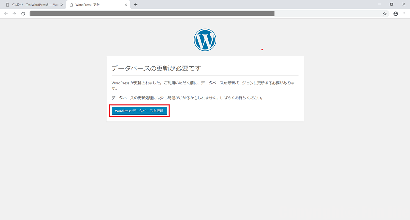

本番環境のWordPressでテーマやCSS、プラグインを編集するには勇気がいるものです。  
そこでローカル環境にいま動いているWordPressを複製して、ローカル環境で気兼ねなくテストできる環境を作っておきましょう。

ローカル環境は「Local By Flywheel」で構築します。

[ローカル環境にWordPress環境を構築する方法]()  
を参考にして下さい。

本番環境→ローカル環境に複製する手順としては、

0. 本番環境をバックアップとってエクスポートする
0. ローカル環境にインポートする

だけなのですが、「All-in-One WP Migration」というプラグインを使うことで簡単に実現できます。

https://ja.wordpress.org/plugins/all-in-one-wp-migration/

## 「All-in-One WP Migration」による複環境製を行う

管理画面のプラグインの「新規追加」の画面にいって、「All-in-One WP Migration」をインストールし、有効化します。

## 本番環境のバックアップ／エクスポートする

「All-in-One WP Migration」のバックアップ画面を表示します。

こちらのプラグインですが、無料版だとインポート時の容量に512MBのサイズ制限がかかります。  
（有料版にアップグレードすることで無制限になるようです）

メディアライブラリ内のデータ（アップロードしたデータ）をバックアップするとあっという間にサイズ制限を超えるので、メディアライブラリを対象から外しておきます。  
ちょっとめんどくさいですが、メディアライブラリ内のデータはサーバーからFTPでダウンロードしましょう。  
ただ、メディアライブラリに関しては、ローカル環境にインポートしなくても。画像が表示されないだけなので、基本的なサイトの動作には影響ないでしょう。

「ファイル」を選択するとエクスポートが始まります。  
しばらく待ちましょう。

完了したらダウンロードします。  
メディアライブラリを除外しても512MBを超えるようであれば、素直に有料版にしたほうが良いかもしれません。  
それくらい便利なプラグインだと思います。

## ローカル環境にインポートする

「Local By Flywheel」でローカル環境に構築したWordPressにインポートします。  
ローカル環境のWordPressにも同じくプラグイン「All-in-One WP Migration」をインストールしておきます。

「All-in-One WP Migration」のインポート画面を表示します。

「ファイル」を選択して、指示通りにすすめていきます。  
アップロードサイズ制限に引っかかる場合、 [最大アップロードファイルサイズを上げる方法](https://help.servmask.com/2018/10/27/how-to-increase-maximum-upload-file-size-in-wordpress/) を参考にしましょう。

しばらく待ちます。  

インポートが完了後、パーマリンクを更新します。

データベースの更新を行い完了です。  
ログイン画面が表示されるはずですので、本番環境のIDとパスワードを入力しましょう。

なお、メディアライブラリは、`\public\wp-content\uploads`（ローカル環境のWordPressフォルダ）配下にアップロードされるので、本番環境からFTPでとってきたファイルをローカルのパスにコピーすることで画像を表示できます。

## まとめ

どうでしょうか。超簡単ですよね。  
これで本番環境と同じ環境をローカルで試すことができます。
