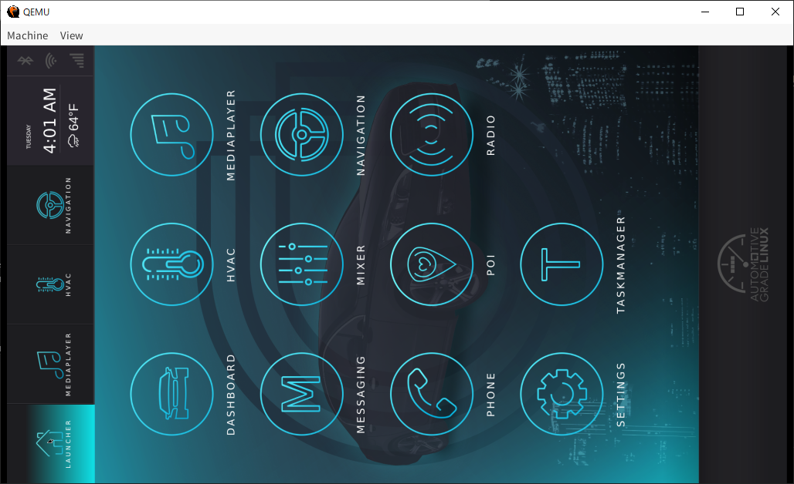

AGL（Automotive Grade Linux）やってみた。

[#0_Getting_Started/1_Quickstart/Using_Ready_Made_Images/](https://docs.automotivelinux.org/en/master/#0_Getting_Started/1_Quickstart/Using_Ready_Made_Images/)  
のx86 (Emulation and Hardware)をやってみた。

## 試した環境

```bash
# Distro
$ cat /etc/lsb-release
DISTRIB_ID=Ubuntu
DISTRIB_RELEASE=20.04
DISTRIB_CODENAME=focal
DISTRIB_DESCRIPTION="Ubuntu 20.04.2 LTS"
# Kernel
$ uname -a
Linux XXX 5.8.0-53-generic #60~20.04.1-Ubuntu SMP Thu May 6 09:52:46 UTC 2021 x86_64 x86_64 x86_64 GNU/Linux
```

## 手順

手順は、`kvm`という仮想化機構の利用を前提していて、ホストPCのCPUに仮想化支援機構が組み込まれているかによって実行手順・結果が変わってくるかも。  
そう古くないCPUでCore i3以上なら気にしなくて良いかと。

確認する場合、`/proc/cpuinfo`に`vmx`というフラグが存在していればOKなはず。
```bash
$ cat /proc/cpuinfo | grep vmx
```

また、公式のやり方は、agl-demoの仮想イメージを`qemu`というアプリケーションで起動して、そこにVNC（vinagre）でリモートログインする方法。  
VNCを介さないやり方で実施してみた。

```bash
# homeフォルダに移動（特に決まりはない）
$ cd ~
# エミュレータをインストール
$ sudo apt install qemu
# qemuからx86_64用Linuxカーネル起動するためのパッケージをインストール
$ sudo apt install qemu-system-x86
# 作業フォルダ作成 & 作業フォルダに移動
$ mkdir agl-demo && cd $_
# agl-demoの仮想イメージ取得
$ wget https://download.automotivelinux.org/AGL/snapshots/master/latest/qemux86-64/deploy/images/qemux86-64/agl-demo-platform-crosssdk-qemux86-64.ext4.xz
# qemuのカーネルイメージ取得
$ wget https://download.automotivelinux.org/AGL/snapshots/master/latest/qemux86-64/deploy/images/qemux86-64/bzImage
# agl-demoの仮想イメージを解凍
$ xz -v -d agl-demo-platform-crosssdk-qemux86-64.ext4.xz
# agl-demoの仮想イメージを指定してqemuを起動
$ sudo qemu-system-x86_64 \
-device virtio-net-pci,netdev=net0,mac=52:54:00:12:35:02 \
-cpu kvm64 \
-cpu qemu64,+ssse3,+sse4.1,+sse4.2,+popcnt \
-enable-kvm \
-m 2048 \
-netdev user,id=net0,hostfwd=tcp::2222-:22 \
-drive file=agl-demo-platform-crosssdk-qemux86-64.ext4,if=virtio,format=raw \
-show-cursor \
-usb \
-vga virtio \
-soundhw hda \
-machine q35 \
-serial mon:vc \
-serial mon:stdio \
-serial null \
-kernel bzImage \
-snapshot \
-append 'root=/dev/vda rw console=tty0 mem=2048M ip=dhcp oprofile.timer=1 console=ttyS0,115200n8 verbose fstab=no'
```

しばらくするとdemo画面が表示された。



スクリーンが横回転になっているのでこれは設定か何かかな。

コンソールは以下（`root`ユーザー／パスワード無し）でログインできる。
```bash
Automotive Grade Linux 11.91.0+snapshot qemux86-64 ttyS1
qemux86-64 login: root
```

シャットダウンするときは
```bash
qemux86-64 login: poweroff
```

このとき、作業内容は消える。  
作業内容を保持したければ`-snapshot \`を削除してqemuを起動すれば良さそう。

## Windouws on VirtualBoxも対応されている

試してはいないが、WindowsでもVirualBox上で動作可能みたい。  
[#0_Getting_Started/1_Quickstart/Using_Ready_Made_Images/#2-virtual-box-emulation](https://docs.automotivelinux.org/en/master/#0_Getting_Started/1_Quickstart/Using_Ready_Made_Images/#2-virtual-box-emulation)

## 参考

* [Automotive Grade Linuxことはじめ](https://qiita.com/mbamba/items/6b302595e29d83e86ceb)
